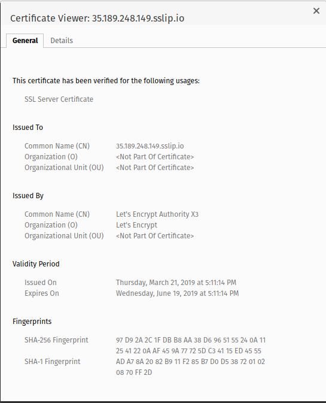

### Homework 6 (terraform-1)

**Задание 1.** Установка утилиты terraform. Подготовка и отладка конфигурации инфтрастуртуры.

Сформированы файлы, необходимые для формирования инфтраструктуры, добавлены описания ресурсов, переменных и их значений в соответствии с рекомендациями.

**Задание со \*, слайд 51.** 

Для добавления ключа одного пользователя я использовал ресурс **google_compute_project_metadata_item**
```
resource "google_compute_project_metadata_item" "ssh_1" {
  key   = "ssh-keys"
  value = "appuser1:${file(var.public_key_path)}"
}
```

Для добавления нескольких ключей использовался ресурс **google_compute_project_metadata**
```
resource "google_compute_project_metadata" "ssh_keys" {
  metadata {
    ssh-keys = <<EOF
    appuser1:${trimspace(file(var.public_key_path))}
    appuser2:${trimspace(file(var.public_key_path))}
    appuser3:${trimspace(file(var.public_key_path))}
    appuser4:${trimspace(file(var.public_key_path))}EOF
  }
}
```

**Задание со \*, слайд 52.** 
Если мы добавим ключ пользователя через web-интерфейс GCP, а потом выполним команду 
```
terraform apply
```
то все доавленное нами ранее будет заменено на то, что указано в описании конфигурации.

**Задание со \*\*, слайд 53.** 
Описание балансировщика приведено в файле lb.tf
Проверена работа балансировщика путем:
- остановки сервиса puma
- остановки одного и всех экземпляров ВМ

**Задание со \*\*, слайд 54.** 
Был добавлен еще один экземпляр ВМ с приложением путем копирпования конфигурации предыдущего экземпляра. Такой подход неудовлетворителен, так как приводит к возрастанию вероятности ошибки при изменении конфигураций, а также к увеличеню трудозатрат на ее поддержание.

**Задание со \*\*, слайд 55.** 
Конфигурация была изменена на использование счетчика **count**. Добавлена переменная, с помощью которой можно регулировать количество экземпляров приложения.

### Homework 5 (packer-base)

**Задание 1.** Установка утилиты packer. Подготовка шаблона для packer.

Сформирован шаблон образа **ubuntu16.json**, кооторый юудет содержать в себе предустановленные monпodb и ruby.
Проверена работоспособность образа путем развертывания из него экземпляра ВМ, установки и проверки работы тестового приложения.

**Задание 2.** Формирование образа, содержащего в себе предустановленное тестовое приложение.

Сформирован шаблон **immutable.json**, описывающий образ системы с предустановленным тестовым приложением.
Созданы скрипты для развертывания приложения в процессе сборки образа, а также установки приложения как демона с использованием systemd.

**Задание 3.** Создание экземпляра ВМ из образа с предустановленным тестовым приложением.

Команда формирования экземпляра ВМ (см. также скрипт create-reddit-vm.sh):

```
gcloud compute instances create reddit-app\
  --image-family reddit-full \
  --machine-type=f1-micro \
  --tags puma-server \
  --zone europe-west1-b \
  --restart-on-failure
```

### Homework 4 (cloud-testapp)
testapp_IP = 35.195.151.40
testapp_port = 9292

**Задание 1.** Установка и настройка утилиты gcloud, создание виртуальной машины
для развертывания тестового приложения, и его развертывание.

Для создания вирутальной машины использовалась команда:

```
gcloud compute instances create reddit-app\
  --boot-disk-size=10GB \
  --image-family ubuntu-1604-lts \
  --image-project=ubuntu-os-cloud \
  --machine-type=g1-small \
  --tags puma-server \
  --restart-on-failure
```

Для развертывания тестового приложения были сформированы скрипты:
```
install_ruby.sh
install_mongodb.sh
deploy.sh
```

**Задание 2.** Создание инстанса вирутальной машины и автоматическое развертывание тестового приложения

Для выполнения задания был создан скрипт, выполняемый автоматически при создании виртуальной машины

```
startup.sh
```

Создание виртуальной машины и развертывание приложения выполняется с помощью команды:

```
gcloud compute instances create reddit-app\
  --boot-disk-size=10GB \
  --image-family ubuntu-1604-lts \
  --image-project=ubuntu-os-cloud \
  --machine-type=g1-small \
  --tags puma-server \
  --restart-on-failure \
  --metadata-from-file startup-script=startup.sh
```

**Задание 3.** Создание правила фаервола с помощью утилиты gcloud:
```
gcloud compute firewall-rules create default-puma-server --allow tcp:9292 --target-tags puma-server
```


### Homework 3 (cloud-bastion)

bastion_IP=35.189.248.149
someinternalhost_IP=10.142.0.2

**Задание 1.** Исследовать способ подключения к someinternalhost в одну команду из вашего рабочего устройства

Для подключения одной командой будем использовать опцию ProxyJump команды ssh:
```
ssh -i ~/.ssh/gc_key -J appuser@35.189.248.149 appuser@10.142.0.2
```

**Задание 2.** Предложить вариант решения для подключения из консоли при помощи команды вида ssh someinternalhost
из локальной консоли рабочего устройства, чтобы подключение выполнялось по алиасу someinternalhost

Для реализации такой схемы подключения используем настройки SSH в файле ~/.ssh/config
```
# Включаем SSH Agent Forwarding для всех хостов
Host *
   ForwardAgent yes

# Описываем схемы нужных хостов
Host bastion
   HostName 35.189.248.149
   User appuser
   IdentityFile ~/.ssh/gc_key

Host someinternalhost
   HostName 10.142.0.2
   ProxyJump bastion
   User appuser
   IdentityFile ~/.ssh/gc_key
```

**Задание 3.** С помощью сервисов sslip.io / xip.io и Let’s Encrypt реализуйте использование валидного сертификата
для панели управления VPN-сервера

Использовался сервис sslip.io, итоговый адрес: https://35.189.248.149.sslip.io/

Скриншот, подтверждающий успешное выполнение задания:


