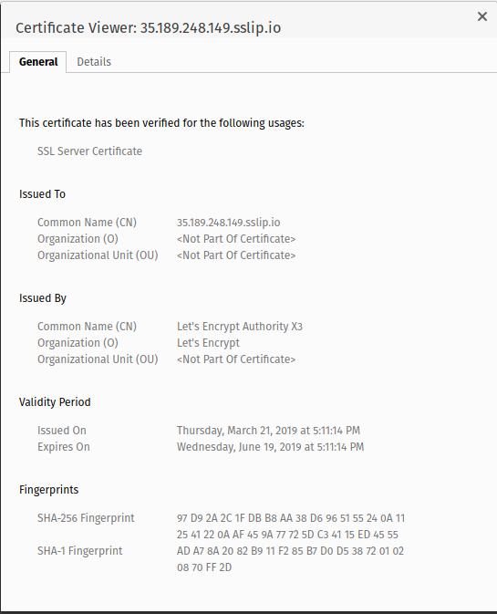

### Homework 3 (cloud-bastion)

bastion_IP=35.189.248.149
someinternalhost_IP=10.142.0.2

**Задание 1.** Исследовать способ подключения к someinternalhost в одну команду из вашего рабочего устройства

Для подключения одной командой будем использовать опцию ProxyJump команды ssh:
```
ssh -i ~/.ssh/gc_key -J appuser@35.189.248.149 appuser@10.142.0.2
```

**Задание 2.** Предложить вариант решения для подключения из консоли при помощи команды вида ssh someinternalhost 
из локальной консоли рабочего устройства, чтобы подключение выполнялось по алиасу someinternalhost

Для реализации такой схемы подключения используем настройки SSH в файле ~/.ssh/config
```
# Включаем SSH Agent Forwarding для всех хостов 
Host *
   ForwardAgent yes

# Описываем схемы нужных хостов
Host bastion
   HostName 35.189.248.149
   User appuser
   IdentityFile ~/.ssh/gc_key

Host someinternalhost
   HostName 10.142.0.2
   ProxyJump bastion
   User appuser
   IdentityFile ~/.ssh/gc_key
```

**Задание 3.** С помощью сервисов sslip.io / xip.io и Let’s Encrypt реализуйте использование валидного сертификата 
для панели управления VPN-сервера

Использовался сервис sslip.io, итоговый адрес: https://35.189.248.149.sslip.io/

Скриншот, подтверждающий успешное выполнение задания:


  